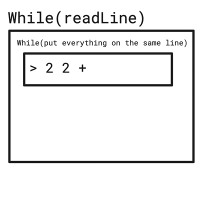

# Table des matières

1. [Introduction](#introduction)
2. [Where i came from and who Im ?](#Where-i-came-from-and-who-Im)
3. [Objectives and progress](#Objectives-and-progress)
4. [My productions](#my-productions)
   1. [TP9](#tp9)
   2. [TP10](#tp10)
   3. [TP12](#tp12)
   4. [TP14](#tp14)
   5. [TP15](#tp15)
5. [Review](#review)
6. [Conclusion](#conclusion)
   1. [Points total accumulé](#Total-Points)

# Introduction

Hello ! in this document i will talk about the work i have done this semester in C programming.

I will try to present my work in a really simple matter but in a fairly detailed one where i will go through every Lab and explain what i learned and what i didn't really get right away.

I will try my best to provide the simplest writing possible please grab a coffee and enjoy the reading. ☕️☕☕️

[Recommended Music to read this document](https://www.youtube.com/watch?v=Y7dbQj8XHmM) 🎶

# Where i came from and who Im ?

My name is Khenissi Mehdi i came from the DUT of Reims that specialize in Computer science.

This is my first year in C programming cause in my last studies we exclusively
worked with python and java and even when we got into a C like language like C++
i really didn't understand cause of stress and other factors.

After the first semester where i tried my best to understand even thought i didn't get a super mark cause ima really slow learner but i feel confident that my level really skyrocketed not only in C but also in computer science in general.

# Objectives and progress

One of my first objectives is to really understand everything about memory allocation cause for it was the most confusing thing i ever learned about.
But in the same way i really enjoyed how we can manipulate memory and have total
control on the machine.

Second objective is that this time i will try to understand what im doing and try to ask for help as often as possible to not lose time.

Third objective is to try to do as many as i can of non-graphic Labs that way i can improve my problem solving skills and now my skills to use a pre-coded library.

So as everything is now clear we can start discussing the work.

# My productions:

I will go over every Lab to explain how i did it also what i understood and what i have to review to understand more.I will also provide an auto-evaluation of what i coded you can see the points that i used here [page](http://igm.univ-mlv.fr/~borie/projet_info1.php).

## [TP9](https://github.com/khenissimehdi/C-TP/tree/master/TP9):

This Lab have 3 exercises so i will try to go other everyone of them.
the first exercise consist of only dynamically allocating a space for an array and filling int with integers from 0 to N where the N is chosen by the user.
to use thing i created a function called allocate_integer_array tha takes an integer as size allocate the space using the malloc function and return a pointer to the newly created array of int.
after that i just used a fillArray function that time a pointer to an array and a size and starting filling it from 0 to N.
and of course we have to make the teacher happy that why i freed the array and checked it with valgrind 😎

The second exercise was the hardest by far cause i didn't know how to free a 2d array and also i didn't know how to fill it by letters exactly as described in the exercise.
i basically tried putting code everywhere i had so many if condition and the code was disgusting i will let you take a look at the old code :

```c
void init_tab_2d(char** tab, int n, int m){
       int x,y = 0;
    char  r ;
    char f ;
    r = 'a';
    f = 'a';
    int h = 0;
    for(x = 0; x< n ; x++){
      int c = 0;
          h = 0;
      for(y=0; y <= m ; y++ ){
          if(r+c <= 'z' ){
            tab[x][y] = r + c;
          }
          else{
            tab[x][y] = f + h;
            if(f + h >= 'z'){
              f = 'a';
              h = 0 ;
            }
            h++;
          }
        c++;
      }
      r = r + 1;
    }
}
```

As you noticed the code is really artistic but as we are coding in C WE DON'T CARE ABOUT BEAUTY.
now let's see the new code i mean the cleaner one.

```c
void init_tab_2d(char** tab, int n, int m){
    int x,y = 0;
    for(x = 0; x < n ; x++){

      for(y=0; y < m ; y++ ){
         tab[x][y] = 'a' + ((x+y) % 26);
          }
      }
    }
```

Comparing both of them we can see that the second one is better and also i think that i should've took more time into understanding the advantages of the modulo
Well by putting all this aside we can go take a close look at the interesting part and its the part where i allocate the 2d array.

So i created a a function called allocate_char2D_array that takes two integers one for the first dimension and another for the second one and return a pointer to pointer of type char that represent a 2d char array.

In this function i begin by allocating the first dimension and then looping inside the that dimension and allocating the second one.

The last thing to do is to just go and free the 2d array for this i also created a function that called free_2D_char that takes 2d array of char and integer.
This function will loop through the the tab using the first dimension and free everything then it will free the whole tab.

Now we can attack the last exercise in this Lab this one consists of allocating and copying the arguments to that same array.
Here again nothing magical as we need to allocate space to string we have to first allocate space to the main array then to the words inside that array after that we can just copying them using the function memcpy here is the code for further understanding

```c
char** optizAloc2(int argc, char *argv[]){
    int i ;
    char** new_tab = (char**)malloc(argc * sizeof(char*));
   for( i=0; i< argc ;i++){

   new_tab[i] = (char *)malloc ((length(argv[i]) * sizeof(char))* sizeof (char));
    memcpy(new_tab[i], argv[i], (length(argv[i]) * sizeof(char)));

  }
  if (new_tab == NULL){
    fprintf(stderr, "Memory allocation error\n");
    return NULL;
  }
  return new_tab;
}

```

| Projet | Pts | I/0 | Type | Progr | Module | Compil | Récursion | Tableaux | Pointeurs | Structures | Allocation | Fichier | Bit à bit | Fct Pointer | Biblio |
| ------ | --- | --- | ---- | ----- | ------ | ------ | --------- | -------- | --------- | ---------- | ---------- | ------- | --------- | ----------- | ------ |
| TP9    | 10  | 1   | 1    | 1     |        | 1      |           | 2        | 1         | 1          | 2          |         |           |

## [TP10](https://github.com/khenissimehdi/C-TP/tree/master/TP10):

This lab was my favorite Lab so far and when i say this i mean the second part of of it but will as always go through the Lab exercise by exercise.

The first exercise is about coding a swap function but this time its not that simple this time we want the swap function to be able to swap any element regardless of the type means that it doesn't matter of the elements are integers, strings or just chars.
To do this i created a function called swap_mem that take two pointer of type void and a size(more on that later).
you are probably asking why i used void as type well i did this cause we don't want specify if we do that the exercise will make no sense and the code will not working on other type outside of the ones you gave to the function. Alright so with all that out of the way we can go talk about the big chunk of the code or in other way the big idea of the code so if you remember earlier we specified a size so why that ? its just we are going to use that too loop through the strings we declared inside of the function cause that how we are going to to swap any elements regardless of the type is just putting the elements inside a string and swap everything inside pretty cool isn't it ? 🤯

Now we can start my favorite of this Lab the second exercise where we are going to use structures pointer and functions that takes other functions in parameters.

I will start by first explaining what is demanded so basically we have text file that have the name, family name and the age of a person
and we have to code a program that put those persons in a chained list and sort them ether alphabetically or by age.

in this lab we have 3 main important problems the first one is to understand how the Structure work and i mean by that what we have inside of it and what is Cell and \* List.

```c
typedef struct cell
{
    char *first_name; /* String  that contains the first name */
    char *last_name; /* String  that contains the last name */
    int age; /* Integer that contains the age */
    struct cell *next; /*a pointer to the next cell cause here we use chained list*/
} Cell, *List;
```

I think you already noticed but we have something kinda weird here what exactly this mean ?

```c
Cell, *List;
```

well it just the same thing but some times people find using Cell directly kind of confusing
here is how i can explain it using code :

```c
typedef struct {
  ...
}Cell, *List;

Cell *lst = List lst;
```

Now lets go to the second most important part and its how we going to read the text file and use the inputs ?
Thanks to fopen that can read a file giving it a certain fileName and fscan that can parse that path line by line we can do a code that looks like this

```c
List head = NULL;
  char first[50];
  char last[50];
  int age;

  FILE *ptr = fopen("fileName.txt", "r");/*opening the file */
  if (ptr == NULL)
  {
    printf("no such file.");
    return 0;
  }
  while (fscanf(ptr, "%s %s %d", first, last, &age) == 3)
  /* parse every line and putting everything we get into 3 variables first, last and age*/
  {
    ...
  }

  fclose(ptr);/*REALLY IMPORTANT ALWAYS CLOSE THE FILE OPNER OR YOU WILL GET MEMORY LOSE*/
```

Now we go check the hardest part of this Lab and tis the function ordered_insertion
this function takes the head of the list a new cell mean and a function.

```c
List *l ;/* head of the chained list */
Cell *new ;/* the new cell that we gonna add */
int order_func(Cell *, Cell *); /* the function that contains the comparing logic */
```

After this out of the way now we have to start coding the function we have 3 things to consider while coding this function the first one is by making sure that the head is not empty

```c
 if (*l == NULL)
  {
    *l = new;
    return;
  }
```

Then we have to check if the head of the list is in the right place comparing it with the new cell using the order function

```c
 else if (order_func(*l, new))
  {
    new->next = *l;
    *l = new;
    return;
  }
```

in the end we have the normal case where we going to loop while using the order function and put the the cell in the right place.

```c
else
  {
    ptr = *l;
    while (ptr->next != NULL && !order_func(ptr->next, new))
      ptr = ptr->next;

    new->next = ptr->next,
    ptr->next = new;
  }
```

and this pretty much it for this Lab the difficulty.

| Projet | Pts | I/0 | Type | Progr | Module | Compil | Récursion | Tableaux | Pointeurs | Structures | Allocation | Fichier | Bit à bit | Fct Pointer | Biblio |
| ------ | --- | --- | ---- | ----- | ------ | ------ | --------- | -------- | --------- | ---------- | ---------- | ------- | --------- | ----------- | ------ |
| TP10   | 11  | 1   | 1    | 1     |        | 1      | 1         |          | 2         | 1          | 1          | 1       |           |             |        |

## [TP12](https://github.com/khenissimehdi/C-TP/tree/master/TP12)

This lab is pretty much the same as the Lab 10 except this time we have to perform a search of a certain word inside a chained list aht we created and we have to create two version of code a naif one and smart one so lets start by the naif one.
Here we are going to look just at the search function :

```c
int check_exist(List *lst, char *word)
{
  List current = (*lst);

  while (current != NULL)
  {

    if (strcmp(current->word, word) == 0)
    {
      return 1;
    }

    current = current->next;
  }
  return 0;
}
```

As we can see here we we loop through all the node using a while loop this is simple but its not the best way to do it when we have a big number of words leaving us with a complexity of O(n) that is basically so bad for us.

That why the second version better cause we use hash table that and for this we are going to need a hash function.
a hash table is just a structure that can map keys to values and all this is done thanks to hash function that will transform the value into a key.
or even in simpler wat a hash table is simply an array that is addressed via a hash function.
Here is a gif that explains the process


With all this said we can now look at th code first lets see the hash function.

```c
unsigned hash(char *elt)
{
  int i;
  unsigned h;

  h = 0;

  for (i = 0; elt[i] != '\0'; i++)
  {
    h += ((i + 1) * elt[i]);
  }

  return h % 4096;
}
```

As we can see here we are just adding ((i + 1) \* elt[i]); to h and doing a modulo by 4096 to stay on the range nth really magical just an application of what demanded.
now lets see the check_exist function :

```c
int check_existTAB(Node *tab[], unsigned hashcode)
{

  if (tab[hashcode] != NULL)
  {
    return 1;
  }

  return 0;
}
```

_Voila !_ comparing it with the naif one our new function is simpler and also faster and that exactly what we want we passed form O(n) to O(1).
this is for this Lab it was really good working it and comparing the naif to the smart one and to see how a really simple solution is sometimes the best.

| Projet | Pts | I/0 | Type | Progr | Module | Compil | Récursion | Tableaux | Pointeurs | Structures | Allocation | Fichier | Bit à bit | Fct Pointer | Biblio |
| ------ | --- | --- | ---- | ----- | ------ | ------ | --------- | -------- | --------- | ---------- | ---------- | ------- | --------- | ----------- | ------ |
| TP12   | 11  | 2   | 1    | 1     |        | 1      |           | 1        | 1         | 2          | 1          | 1       |           |             |        |

## [TP14](https://github.com/khenissimehdi/C-TP/tree/master/TP14)

This lab wasn't really that hard expect the part where i had to understand how ftw works this what the man page say about it

```
The ftw() function shall recursively descend the directory hierarchy rooted in path.
```

It takes a path and a function that we can use to any goal we want in my case i used it to get the the file name and size returned by ftw.
In this lab i used the same code i used in the Lab 10 the one that takes names and ages of people and put insert them in a cell well for this lab its the same thing but we don't take names we take the file name and the size of the file and we call the function ordered insertion on it to store the element sorting by size from the biggest to the smallest one.Then i just print the first 10 one and i free the chained list.
for this lab i wasn't so sure about my solution cause think allocating place for more then 10 files and then we show only the first 10 biggest one is kind of bad but i wanted to use what we learned that why also it better to compare then insert to a chained list.

| Projet | Pts | I/0 | Type | Progr | Module | Compil | Récursion | Tableaux | Pointeurs | Structures | Allocation | Fichier | Bit à bit | Fct Pointer | Biblio |
| ------ | --- | --- | ---- | ----- | ------ | ------ | --------- | -------- | --------- | ---------- | ---------- | ------- | --------- | ----------- | ------ |
| TP14   | 11  | 1   | 1    | 1     |        | 1      |           | 1        | 1         | 2          |            | 2       |           | 2           | 1      |

## [TP15](https://github.com/khenissimehdi/C-TP/tree/master/TP15)

This Lab was the hardest so far in term of understanding how some libraries works.
In This lab we will have to code a Reverse Polish calculator here is quick demo of what we expect to have.


first thing i did is to implment the stack so went and created a stack.h and a stack.c unitl here everything is kinda simple.
after that i created two files operation.c and operation.h where i put my operations like addition, division etc and after putting all this aside now we got tot the hard part.

the hard part is that you have to know what to use when i started this Lab i was going ot a direction where i was going to create my own parser sadly my ignornce have hidden from me that this parser already exisit and its caled strtol and its really esay to use.

```c
  char *endptr;
  long val;
    if (isNumeric(word) == 1)
      {
        val = strtol(word, &endptr, 10);
        push_stack(s, val);
      }
      else
      {
        printf("Unknown operation %s \n", word);
      }
```

And yes just like this 80 % of the work is already done so please let me explain what is going on here.
in the if we check if the input is a number using the isdigit function from ctype.h by looping thoogh all the input and if it not the case we say that the operation is unknown.

```c
int isNumeric(char *str)
{
  int i;
  for (i = 0; i < strlen(str); i++)
  {
    if (isdigit(str[i]) == 1)
    {
      return 1;
    }
  }

  return 0;
}
```

After doing the hard part of the Lab now we have to get the user input and to do that i used the readLine library and also readLine/History to get he older inputs here is code snippet that show the logic

```c
 while ((line = readline("> "))) /* Store the input read by readline in the variable line */
 {
   add_history(line); /* Add the line to history */
   ...
   free(line) /* Free the line cause readLine uses malloc */
 }

 clear_history(); /* Clear the history */
```

Now we juste have add the condition so that when the user enter an operation symbole like +,- or \* we do something.and we also want to to put multiple opertion and numbers at the same time means that to do that we to treat every input seprated by space alone.The solution here is to code two while loops one for the whole code and the other for this specific feature.Here a gif that explains the idea.



After all this we had to generatre a library for the stack this was pretty easy we just had to use the command :

```c
ar rs libstack.a stack.o
```

then add it the makefile.
to see what we go inside it we use :

```c
nm --defined-only libstack.a
```

And that it for this lab it it was a really hard one cause we had to use libraries that we don't know but i can say that learned a lot from it
| Projet | Pts | I/0 | Type | Progr | Module | Compil | Récursion | Tableaux | Pointeurs | Structures | Allocation | Fichier | Bit à bit | Fct Pointer | Biblio |
| ------ | --- | --- | ---- | ----- | ------ | ------ | --------- | -------- | --------- | ---------- | ---------- | ------- | --------- | ----------- | ------ |
| TP15 | 16 | 2 | 1 | 1 | | 1 | 2 | | 1 | 1 | 2 | | |1 |2 |

# Review

This semester i didn't review anyone but i got reviewed by Mister Fabian Reiter and a friend Guillaume DOMART
Guillaume DOMART reviewed the Lab number 10 sadly when i coded the first time everything was working but it wasn't that clear i had no comments and my variables wasn't properly names so i want through all the lab and changed everything that didn't work.

Mister Fabian Reiter reviewed the Lab number 14 where i forget again to put comments but i also forget to remove debug elements i also forget tp add some files to the makeFile.
but the two biggest flaws in my code where in the function ordered_insertion that was badly coded and didn't really provide what we wanted cause i had a mistake in the last condition that will loop inside the chained list and put the new cell in the right place. The second flaw is that i was allocating space for now reason where i just have to change the signature of allocate_cell to :

```c
Cell *allocate_cell(const char *path_name, int size);
```

that way i don't have to allocate space the const string returned by ftw and copied on that allocated space.

Here is a link to the two reviews :

[Guillaume DOMART](./Review_TP10.md)

[Fabian Reiter](./Review_TP14.md)

# Conclusion

Now we come the end of the review we can see that even if i didn't do everything but learned a lot specially now i comfortable working with mallocs and algorithmic structures like chained list.

Im satisfied with what i've done and i think that i tackled the skills that i didn't have and that i was afraid of memory allocation are a thing a the past now.

## Total Points:

| Projet | Pts | I/0 | Type | Progr | Module | Compil | Récursion | Tableaux | Pointeurs | Structures | Allocation | Fichier | Bit à bit | Fct Pointer | Biblio |
| ------ | --- | --- | ---- | ----- | ------ | ------ | --------- | -------- | --------- | ---------- | ---------- | ------- | --------- | ----------- | ------ |
| Total  | 59  | 8   | 5    | 5     | 1      | 7      | 1         | 4        | 5         | 8          | 6          | 3       | 0         | 3           | 3      |

My total point of the C1 + C2 is 112 that i think is fair enough for someone that had real difficulties starting C programming.

Thank you so much for reading hope it was clear.
